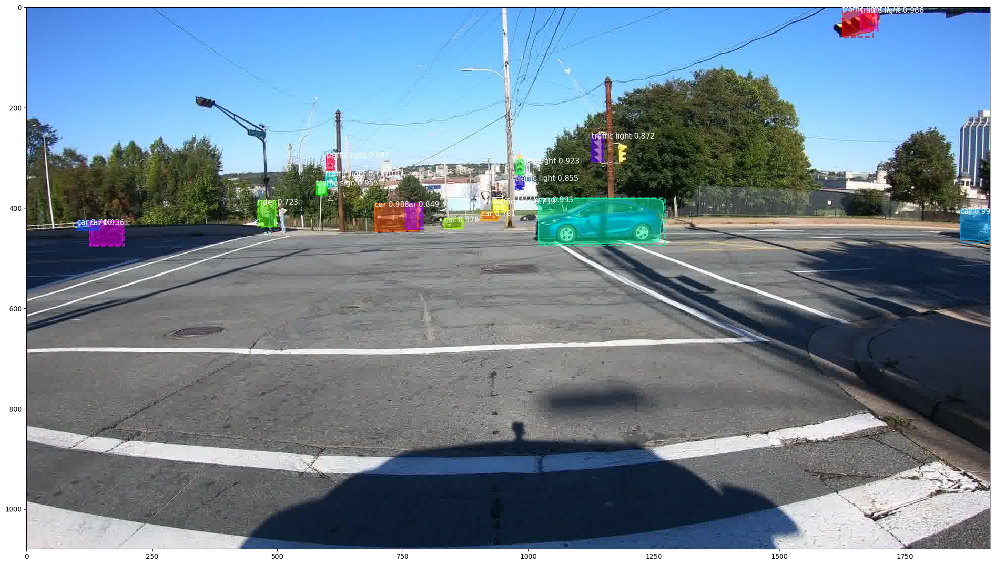

# Object-detection-and-segmentation-for-self-driving-cars
Utilize bdd100k dataset and mask r-cnn to detect and recognize objects for self driving cars

This is an implementation of [Mask R-CNN](https://arxiv.org/abs/1703.06870) on Python 3, Keras, and TensorFlow. The model generates bounding boxes and segmentation masks for each instance of an object in the image. It's based on Feature Pyramid Network (FPN) and a ResNet101 backbone.

The repository includes:
* Source code of Mask R-CNN built on FPN and ResNet101.
* Training code for BDD100k
* Pre-trained weights for BDD100K
* Jupyter notebooks to visualize the detection pipeline at every step
* Parallel Model class for multi-GPU training

The code is based on [Matterport's Mask_RCNN](https://github.com/matterport/Mask_RCNN).

# Getting Started
* [demo.ipynb](object_detection/demo.ipynb) Is the easiest way to start. It shows an example of using a model pre-trained on BDD100k to segment objects in your own images.
It includes code to run object detection and instance segmentation on arbitrary images.

* ([model.py](object_detection/mrcnn/model.py), [utils.py](object_detection/mrcnn/utils.py), [config.py](object_detection/mrcnn/config.py)): These files contain the main Mask RCNN implementation. 

* [inspect_data.ipynb](object_detection/inspect_data.ipynb). This notebook visualizes the different pre-processing steps
to prepare the training data.

* [inspect_model.ipynb](object_detection/inspect_model.ipynb) This notebook goes in depth into the steps performed to detect and segment objects. It provides visualizations of every step of the pipeline.

* [inspect_weights.ipynb](object_detection/inspect_weights.ipynb)
This notebooks inspects the weights of a trained model and looks for anomalies and odd patterns.

# Training on BDD100k
I'll be providing pre-trained weights for BDD100k to make it easier to start. You can
use those weights as a starting point to train your own variation on the network.

* Download BDD100k
* Clone [Toolkit to Use BDD Dataset](https://github.com/ucbdrive/bdd-data)
* Using [bdd2coco.py](https://github.com/ucbdrive/bdd-data/blob/master/bdd_data/bdd2coco.py) convert bdd dataset into coco format
* Training and evaluation code is in `object_detection/perception.py`. You can import this
module in Jupyter notebook (see the provided notebooks for examples) or you
can run it directly from the command line as such:

